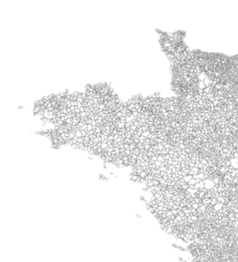
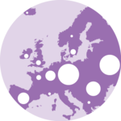
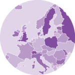
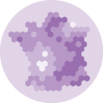
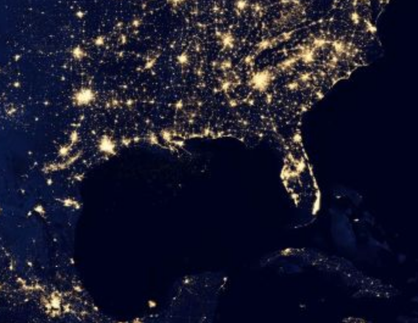
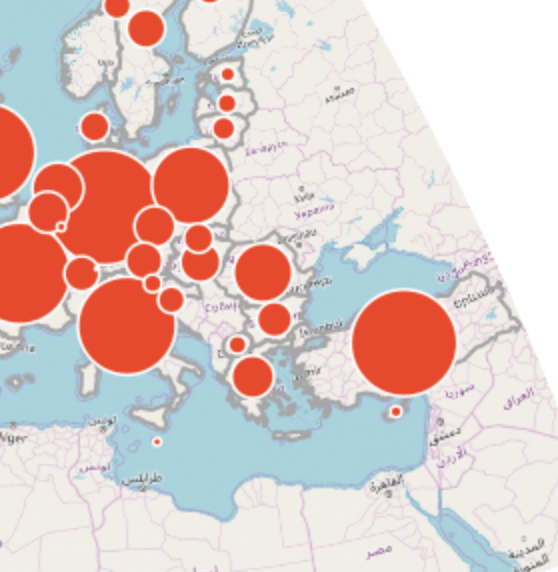

<script type="text/x-mathjax-config">
  MathJax.Hub.Config({ TeX: { equationNumbers: {autoNumber: "all"} } });
</script>

```{r echo = FALSE}
# library(rmarkdown)
# setwd("")
# f <- list.files()[1]
# render(f, output_format='pdf_document')
```

```{r, set-options, echo = FALSE, cache = FALSE}
options(width=100)
knitr::opts_chunk$set(
 eval = F, # run all code
 # echo = FALSE, # show code chunks in output 
 comment = "",
 tidy.opts=list(width.cutoff=100), # set width of code chunks in output
 tidy=TRUE, # make output as tidy
 message = FALSE,  # mask all messages
 warning = FALSE, # mask all warnings 
 size="small" # set code chunk size
)

# https://github.com/ucb-stat133/stat133-fall-2016/blob/master/hws/hw02-tables-ggplot.Rmd
knitr::opts_knit$set(root.dir=paste0(params$dir,"/")) # set working dir

setwd(paste0(params$dir,"/")) # for running just in R not knitr
```

\  

Date: `r params$date`  
`R` version: `r params$version`  
*Corresponding author: `r params$email`  
This document can be found at `r params$doi`

\newpage  

TO DO:  
- Figure out how to unlist the 'locations.activitys' col in 'data' after converting from JSON to dataframe with jsonlite  
- Fix Open Street Maps: `osm` code chunk        

\newpage  

## Overview

This document converts __.json__ Google Maps data into useable `R` data for mining and plotting with `ggmap` and related packages. It also has links to obtaining Google API keys for using Google-protected data.         

### Working with Google Maps data   
Converting .json to .csv: [https://konklone.io/json/](https://konklone.io/json/)  

### Troubleshooting

[geocode failed with status REQUEST_DENIED, location = ... ](https://stackoverflow.com/questions/52565472/get-map-not-passing-the-api-key-http-status-was-403-forbidden/52617929#52617929)  

[Troubleshooting with `ggmap` package installation](https://stackoverflow.com/questions/40642850/ggmap-error-geomrasterann-was-built-with-an-incompatible-version-of-ggproto)    

[When encountering error in fetch(key) : lazy-load database](https://stackoverflow.com/questions/30424608/error-in-fetchkey-lazy-load-database)  
```{r eval=F, echo=F, results='hide'}
.rs.restartR() # restart R session 
rm *.rdb # remove .rdb package 
```

[Getting **OVER QUERY LIMIT** after one request with geocode error](https://stackoverflow.com/questions/36175529/getting-over-query-limit-after-one-request-with-geocode)  

[Error: map grabbing failed - see details in ?get_openstreetmap](https://stackoverflow.com/questions/23572996/ggmap-gives-error-when-using-open-street-map-as-source) when using `osm` source in `getmap()`   
[Applying `get_map` functions](https://github.com/dkahle/ggmap/blob/master/R/get_map.R)  

\newpage    

######  

### Install packages  
```{r, load packages, include=T, cache=F, message=F, warning=F, results='hide'}
packages <- c("animation","RColorBrewer","dplyr","ggmap","RgoogleMaps","sp","maptools","scales","rgdal","ggplot2","leaflet","jsonlite","readr","devtools","mapdeck","gganimate","tmap")
if (require(packages)) {
  # suppressPackageStartupMessages(
    install.packages(packages,dependencies = T)
    # )
  require(packages)

# install RgoogleMaps and OpenStreetMap separately, for some reason  
  install.packages("RgoogleMaps"); library(RgoogleMaps)
  install.packages("OpenStreetMap"); library(OpenStreetMap)
  install.packages("leaflet"); library(leaflet)
  install.packages("googleway") ; library(googleway)
  
# install geojsonio from github and source
  devtools::install_github("ropensci/geojsonio"); library(geojsonio)
}

ppp <- lapply(packages,require,character.only=T)
if(any(ppp==F)){cbind(packages,ppp);cat("\n\n\n ---> Check packages are loaded properly <--- \n\n\n")}

```

Install `ggmap` from source separately    
```{r}
devtools::install_github("dkahle/ggmap", ref = "tidyup"
                           ); library(ggmap)
```


######

### Weird Google things you need to do
Google has individual limits on who and how often one can independently use Google data, so in order to access and analyse your Google Maps data, you need to submit an Application Programming Interface (API) query to Google. Straightforward, but necessary.  

\  

1. [Get API key](https://developers.google.com/maps/documentation/geocoding/get-api-key)  
2. Follow the instructions in your email to access your key. This may take 24 hours.   

### `ggmap` features  
\  
#### Functions
```{r eval=F, echo=F, results="hide"}   
### functions ###
ggmap_funcs <- c("get_map", "get_googlemap", "get_openstreetmap", "get_stamenmap", "get_cloudmademap", "all return class = raster"); print("ggmap functions:");ggmap_funcs

```

#### The `get_map` wrapper  
`get_map` maptypes       
The different types of background graphics you can use as a base to your map  
```{r}   
maptypes <- c("terrain", "terrain-background", "satellite", "roadmap", "hybrid", "toner", "watercolor", "terrain-labels", "terrain-lines", "toner-2010", "toner-2011", "toner-background", "toner-hybrid", "toner-labels", "toner-lines", "toner-lite");maptypes
```

`get_map` sources     
The type of map design template you want to plot.    
- Google Maps (google). The standard Google Maps map.     
- OpenStreetMap (osm). A map that uses basic fore- and background colours.     
- Stamen Maps (stamen).   
- CloudMade maps (cloudmade). Maps design templates made from other users.    
```{r}   
sources <- c("google","osm","stamen","cloudmade");sources
```

`get_map` plotting     
Register your API key with your Google developer account 
```{r}
api_key <- readLines("ayepeeeye.txt") 
register_google(key = api_key) # register key 
```

Geocoding API test. Run the below steps and [see here for troubleshooting.](https://stackoverflow.com/questions/51481913/error-when-mapping-in-ggmap-with-api-key-403-forbidden/52617264#52617264)  

```{r}
# should spit out a bunch of r dataframe objects
geocode("Melbourne", output = "all")
# should plot a basic map of Melbourne
ggmap(get_map("Melbourne"))

```

#### Using geocoding  
```{r}
require(ggmap)
# 16-1-19 
# removed Geocoding and Geolocation from API restrictions (previously part of list)
# https://github.com/dkahle/ggmap/issues/213

# enter location
loc <- "Naroibi" # enter location on globe 
loc_stats <- geocode(loc,output="all",override_limit = FALSE) # see all available data using geocode function 
map <- get_map(loc) # convert to get_map object
ggmap(map)

# takes multiple inputs that can also be colloquial
addies <- c("Leipzig", "the taj mahal")
geocode(addies)

# turn multiple locations into df
mutate_geocode(df, addies)
df %>% mutate_geocode(addies)

# plot with specs 
map <- get_map(addies[1], zoom = zoom, source = source, maptype = maptype) # get map 

zoom <- 6 # 10 = metropolitan level, 18 = street level. 12 is a useable city level
source <- "stamen"
maptype <- "toner"
bg <- "white" # set background color

map <- get_map(loc, zoom = zoom, source = source, maptype = maptype) # get map to plot

# generate some noisy data
latlon <- geocode(loc,output="latlon",override_limit = FALSE) # get lon and lat
lon <- latlon[1] %>% as.numeric(); lat <- latlon[2] %>% as.numeric() # numerics
lon <- runif(100,lon-0.01,lon+0.01); lat <- runif(100,lat-0.01,lat+0.01)
latlon_df <- data.frame(lon,lat)

# plot map with geocode points   
naro <- ggmap(map,
      legend="topright",
      extent="device",
      padding=0.5,
      darken=c(0.5,bg) # 0.1 = high contrast
      ) + 
  geom_point(aes(latlon_df[,1],latlon_df[,2],color=I("pink")),cex=3,data=latlon_df)

naro
ggsave("ggmap_test.png",naro,width=11,height=16,unit="in",dpi=1000,limitsize=F)

# adding Google Maps markers
map <- get_map(loc, zoom=z, sources = "stamen", maptype = maptype, markers=latlon_df)
ggmap(map)
ggmap(map,extent="device") # plot without axes

```

The below map list plots examples of the different maptypes and sources available 
```{r , eval=F}

# redo map list? uses API requests, so check loaded file first 
save_map_list <- 0 # 1 = already saved

# diff map types
maptypes
sources

if(save_map_list==1){
  layout(matrix(1:length(maptypes), 4, 4, byrow = TRUE)) # set plot window
  sc <- 1 # sources counter
  map_list <- list()
  for(m in 1:length(maptypes)){
    map <- get_map(loc, zoom=12, sources = sources[sc], maptype = maptypes[m])
    map_list[[length(map_list)+1]] <- map
    if(sc == 4){sc <- 1}else{sc = sc + 1}
  }
  saveRDS(map_list,paste0(getwd(),"/map_list.Rda")) # save to file
}else{ 
  saved_maps <- readRDS("map_list.Rda") # load saved map list
}# end save_map_list

mm <- 11 # choose map type
ggmap(saved_maps[[mm]],darken=0.3,extent="device")

# loop through maps  
mm <- 2
for(mm in 1:length(saved_maps)){
  pdf(paste0("map_list_",mm,".pdf"), onefile = T,paper="a4")
  ggmap(saved_maps[[mm]],darken=0.3,extent="device")
  title(attr(saved_maps[[3]],"source"), attr(saved_maps[[3]],"source"))
  dev.off()
}

# add title to maps
attr(saved_maps[[3]],"source")
attr(saved_maps[[3]],"maptype")


### applying data points ###
# qmplot
murder <- subset(crime, offense == "murder")
qmplot(lon, lat, zoom = 11, data = murder, source=source,colour = I('pink'), size = I(2), darken = .3) 

```

Example of route plotted on terrain map  
```{r}
# http://eriqande.github.io/rep-res-web/lectures/making-maps-with-R.html

# head(bike)
#>         lon      lat elevation                 time
#> 1 -122.0646 36.95144      15.8 2011-12-08T19:37:56Z
#> 2 -122.0646 36.95191      15.5 2011-12-08T19:37:59Z
#> 3 -122.0645 36.95201      15.4 2011-12-08T19:38:04Z
#> 4 -122.0645 36.95218      15.5 2011-12-08T19:38:07Z
#> 5 -122.0643 36.95224      15.7 2011-12-08T19:38:10Z
#> 6 -122.0642 36.95233      15.8 2011-12-08T19:38:13Z

bikemap1 <- get_map(location = c(-122.080954, 36.971709), maptype = "terrain", source = "google", zoom = 14)

ggmap(bikemap1) + 
  geom_path(data = bike, aes(color = elevation), size = 3, lineend = "round") + 
  scale_color_gradientn(colours = rainbow(7), breaks = seq(25, 200, by = 25))
```

Heatmap example
```{r}
# https://blog.dominodatalab.com/geographic-visualization-with-rs-ggmaps/
# Package source URL: http://cran.r-project.org/web/packages/ggmap/ggmap.pdf
# Data source URL: http://www.geo.ut.ee/aasa/LOOM02331/heatmap_in_R.html
 
install.packages("ggmap")
library(ggmap)
 
# load the data
tartu_housing <- read.csv("data/tartu_housing_xy_wgs84_a.csv", sep = ";")
 
# Download the base map
tartu_map_g_str <- get_map(location = "tartu", zoom = 13)
# Draw the heat map
ggmap(tartu_map_g_str, extent = "device") + geom_density2d(data = tartu_housing, aes(x = lon, y = lat), size = 0.3) + 
  stat_density2d(data = tartu_housing, 
                 aes(x = lon, y = lat, fill = ..level.., alpha = ..level..), size = 0.01, 
                 bins = 16, geom = "polygon") + scale_fill_gradient(low = "green", high = "red") + 
  scale_alpha(range = c(0, 0.3), guide = FALSE)

```

Geographic path mapping  
```{r}
# https://flowingdata.com/2014/02/05/where-people-run/
```


Leaflet example  
```{r}
# https://blog.dominodatalab.com/applied-spatial-data-science-with-r/
# cloud maps and stacking map layers to create your own  
# https://rstudio.github.io/leaflet/basemaps.html


###########################################################################
######################################## leaflet ##########################
###########################################################################

# load data
site_names <- c("Kisumu","Lake Jipe","Kinango")
kisumu <- c(-0.0917,34.7680)
lake_jipe <- c(-3.6019,37.7557)
kinango <- c(-4.1393,39.3180)
latlon <- t(data.frame(kisumu,lake_jipe,kinango))
colnames(latlon) <- c("lat", "lng") # need to be named this
latlon

############################ creating maps ############################

# useful help pages
?addCircles

### default maps
require(leaflet)
map <- leaflet() # initiate the leaflet map object
map <- addTiles(map) # add the actual map tiles to the leaflet object
map <- addCircles(map,sample(35,20,replace=T),sample(35,20,replace=T)) # generate some random data around lat/lon 35
map

### custom map 
# add custom base layers 
names(providers) # types of base maps available
# some good custom layers
# 37-48, 97-103, 
provider_type <- names(providers)[37]
provider_type2 <- "CartoDB.Positron"# "Stamen.Toner" # set the above input as the custom base
col_site <- "red" # colour of site marker
radius <- 5 # size of site marker
zoom <- 6 # zoom level
opac <- 1 # transparency of map elements
weight <- 2 # width of poly lines
fill_polygon <- TRUE # FALSE = just draw lines among points 


map <- leaflet() # initiate the leaflet map object

# find good zoom level 
bl <- NULL # bottom left
tl <- NULL # top left
tr <- NULL # top right 
br <- NULL # bottom right 
map_aerial <- fitBounds(map, bl, tl, tr, br)

# add the site locations 
map <- addCircles(map, 
                  lng = latlon[,"lng"],
                  lat = latlon[,"lat"],
                  radius = radius,
                  stroke = TRUE,
                  weight = weight, 
                  opacity = opac,
                  color = col_site,
                  fillColor = col_site,
                  label=site_names,
                  popup=site_names,
                  data=latlon)

map <- addPolylines(map, 
                  lng = latlon[,"lng"],
                  lat = latlon[,"lat"],
                  color = col_site,
                  fillColor = col_site,
                  fill = fill_polygon,
                  weight = weight
)


# add custom map bases 
map <- addProviderTiles(map, provider_type,
                        options = providerTileOptions(opacity = opac) # add opacity to country lines
                        )
# plot
map

# add more map type layers on top of each other
# !!! need to re-initiate map to see changes because it just stacks maps on top of each other
map <- addProviderTiles(map, provider_type2)
map

# save to file 
require(mapview)
webshot::install_phantomjs() # need to install for mapshot()
setwd("/Users/malishev/Documents/Data/gggmap/")

mapshot(map, file = "mapshot_test.pdf",
        vwidth=600,vheight=900,
        remove_controls = c("zoomControl", "layersControl", "homeButton", "scaleBar"))

# save as html widget 
require(htmlwidgets)
saveWidget(map,"mapshot.html")

# to save to file
  # generate plot
  # expand to plot window
  # right click > Open frame in new window
  # Print icon > Save to PDF > High quality  

```


#### My Google Maps data   

Load data   
```{r}
setwd(params$dir)

#### WORKING 20-9-18
#### converting json data
require(jsonlite)
data <- fromJSON("LocationHistory.json",simplifyDataFrame=T,flatten=T)
data <- as.data.frame(data)
head(data)
colnames(data)[c(1,2,3)] <- c("TimeStamp","Lat","Lon")
data <- data[!is.na(data$Lat),] # remove NA rows 
head(data)
with(data,plot(Lat,Lon,type="l",lwd=3,col="steel blue"))

# to access activity type in data, e.g. still, tilting, etc ...
## this only uses csv (converts json to csv externally) https://konklone.io/json/
f <- list.files(pattern = "*.csv")[2]
data <- read.csv(f,header=T,sep=",",stringsAsFactors = T)
data <- as.data.frame(data)
colnames(data)[c(1,2,3)] <- c("TimeStamp","Lat","Lon")
data <- data[!is.na(data$Lat),] # remove NA rows 
# make latlon into degrees
require(stringi)
stri_sub(data$Lat, 4, 2) <- "." ; data$Lat <- sapply(data$Lat,as.numeric) 
stri_sub(data$Lon, 4, 2) <- "." ; data$Lon <- sapply(data$Lon,as.numeric) 

# plot world map
library(rworldmap)
newmap <- getMap(resolution = "low")
# Colombia/Ecuador
xlims <- c(-80,-60) 
ylims <- c(-20,20)
plot(newmap, xlim = xlims, ylim = ylims, asp = 1, axes=T)

# plot world map
plot(newmap)

# plot personal data (Melbs)     
xlims <- c(144,148) 
ylims <- c(-30,-40)
plot(newmap, xlim = xlims, ylim = ylims, asp = 1, axes=T)
par(new=T)
points(data$Lon, data$Lat, pch=20, col = "red", cex = 0.3)


# get intro to rworldmap
vignette('rworldmap')

```

```{r}

location <- "" # enter location on globe or leave blank to get map from your own data points   
api_key <- "" # enter API key

```


Plotting my Google Maps data    
```{r}
require(ggmap); require(viridis)

my_map <- function(location,zoom,source,maptype,bg,darken,colv,alpha){
  # zoom: 10 = metropolitan level, 18 = street level. 12 is a useable city level
  # set source. see 'sources'
  # set maptype. see 'maptypes'
  # set background colour for maptype
  # set opacity of background colour [0,1]
  # set colour palette  
  # set transparency for data points 
  
  # fix GPS data points
  require(stringi)
  stri_sub(data$Lat, 4, 2) <- "."  
  stri_sub(data$Lon, 4, 2) <- "." 
  # set back to numeric
  data$Lat <- as.numeric(data$Lat); data$Lon <- as.numeric(data$Lon) 
  if(is.character(location)==F){ # if location is based on data
    location <- rev(data[1,c(2,3)]) # use data lon/lat for centre of map 
  }
  
  # get map to plot
  map <- get_map(location, zoom = zoom, source = source, maptype = maptype) 
  
  # plot map with geocode points   
  ggmap(map,
        legend="topright",
        extent="device",
        padding=0.5,
        darken=c(darken,bg) # 0.1 = high contrast
        ) +
    geom_point(aes(x = Lon, y = Lat,color=I(colv)),alpha=alpha, data=data)
} # end function
my_map(location,14,"stamen","toner","steel blue",0.3,"pink",0.5)

```

#### Google Maps: `get_googlemap`  

`get_googlemap` maptypes      
```{r}
maptypes_google = c("terrain", "satellite", "roadmap","hybrid");maptypes_google
```

`get_googlemap` plotting  
```{r}
require(ggmap)

loc <- "Melbourne" # enter location on globe 
lon <- geocode(loc)[,1]; lat <- geocode(loc)[,2] # get lon and lat

zoom <- 12 # 10 = metropolitan level, 18 = street level. 12 is a useable city level
scale <- 1
maptype <- "terrain"

# define markers to plot  
##  data frame needs to be [lon,lat]   
markers <- data.frame("lon"=c(lon,lon+0.05),"lat"=c(lat,lat+0.0002)) 

map <- get_googlemap(loc,
                     markers=markers,
                     path=markers,
                     # path=markers,
                     zoom=zoom,
                     format="png8",
                     scale=scale,
                     maptype=maptype) # get map

ggmap(map,extent="device") # plot

```

#### Open Street Maps: `osm`  

1. First, get the `bbox` parameters for the location you want to plot by typing your location into this site: [https://www.openstreetmap.org/export#map=15/33.7500/-84.3758](https://www.openstreetmap.org/export#map=15/33.7500/-84.3758).  
Input your `bbox` parameters  
```{r}
bl <- -84.3957 # bottom left
tl <- 33.7397 # top left
tr <- -84.3560 # top right
br <- 33.7603 # bottom right 
```

\  
2. Use the following guide to define your zoom and scale factor for your location.  
```{r eval=F, echo=F, results="hide"}
# guide for defining zoom and scale factor 
zoom_scale <- data.frame("zoom"=0:20,"scale"=(c("559.082.264", "279.541.132", "139.770.566", "69.885.283", "34.942.642",	"17.471.321", "8.735.660","4.367.830","2.183.915","1.091.958","545.979","272.989","136.495","68.247","34.124",	"17.062","8.531","4.265","2.133","1.066","533"))); zoom_scale
```

`osm` plotting  
```{r}
require(ggmap)
osm <- c(bl,tl,tr,br) 
# check zoom level for osm maps. can't be too high: https://stackoverflow.com/questions/23572996/ggmap-gives-error-when-using-open-street-map-as-source  
if(zoom<13){
  get_openstreetmap(osm)
}else{
    print("Check zoom level is < 13")
  }

qmap(baylor, zoom = 14, maptype = 53428, api_key = api_key,
     source = "cloudmade")
qmap("houston", zoom = 14, maptype = 58916, api_key = api_key,
     source = "osm")
```


### Geocodes  
[Geocode](https://developers.google.com/maps/documentation/geocoding/intro#StatusCodes) converts addresses to latlong coords.    
Get `geocode` parameters for a location
```{r}
location <- "houston texas"
gc <- geocode(location, 
              output = "all", # "latlon", "latlona", "more", "all"
              source="google" # "google" or "dsk"
              ) 

```

Google only allows you a certain amount of memory to use its geocode data for each session. After this threshold, you can no longer call the data. To check how many geocode queries you have remaining from Google, type the following:  
```{r}
geocodeQueryCheck() 
```

The `googleway` package
```{r}
# using googleway pck
# https://github.com/SymbolixAU/googleway/blob/master/vignettes/googleway-vignette.Rmd
require(googleway)
loc <- "Medellin"
google_map(api_key,location=loc)

```

Reading in KMZ and KML data (My Google Maps)  
```{r}

# generate new map from my google maps
# https://www.google.com/maps/d/u/0/edit?hl=en&mid=1vOwf8JGREFlxtYj6mQrrErtH-ZN59pYE&ll=33.02680253949511%2C-89.68289500000003&z=6

# http://r-sig-geo.2731867.n2.nabble.com/reading-kmz-file-in-R-td5148622.html
library(maptools) 
getKMLcoordinates(textConnection(system("unzip -p /Users/foo/test.kmz", intern = TRUE))) 


```


Animating maps 

```{r}
install.packages("gganimate")
install.packages("tmap")
require(tmap);require(gganimate)
??tmap_animation

# https://bookdown.org/robinlovelace/geocompr/adv-map.html

```

3D maps  
```{r}
# https://bookdown.org/robinlovelace/geocompr/adv-map.html
# @mapdeck
install.packages("mapdeck")
install.packages("usethis")

library(mapdeck)
mb_key <- readLines("mb.txt")

set_token(Sys.getenv(mb_key))
df = read.csv("https://git.io/geocompr-mapdeck")
df <- df[ !is.na(df$lng ), ]
df <- df[ !is.na(df$lat ), ]

ms = mapdeck_style("dark")
mapdeck(style = ms, token = mb_key, pitch = 45, location = c(0, 52), zoom = 4) %>%
add_grid(data = df, lat = "lat", lon = "lng", cell_size = 1000,
         elevation_scale = 50, layer_id = "grid_layer",
         colour_range = viridisLite::plasma(6))


```

Add Google driving routes (paths/routes/poly lines)

```{r}
# https://stackoverflow.com/questions/44283774/flow-maptravel-path-using-lat-and-long-in-r
require(googleway)
df = read.csv("https://git.io/geocompr-mapdeck")
df = df[1:500,] # truncate data 

df$drivingRoute <- lst_directions <- apply(df, 1, function(x){
    orig <- as.numeric(c(x['lat'], x['lng']))
    dest <- as.numeric(c(x['lat'], x['lng']))

    dir <- google_directions(origin = orig, destination = dest, key =  api_key)
    dir$routes$overview_polyline$points
})

style <- '[ { "stylers": [{ "visibility": "simplified"}]},{"stylers": [{"color": "#131314"}]},{"featureType": "water","stylers": [{"color": "#131313"},{"lightness": 7}]},{"elementType": "labels.text.fill","stylers": [{"visibility": "on"},{"lightness": 25}]}]'


google_map(key = api_key, style = style) %>%
    add_polylines(data = df, 
      polyline = "drivingRoute", 
      mouse_over_group = "lat",
      stroke_weight = 0.7,  
      stroke_opacity = 0.5, 
      stroke_colour = "#FF3333")

?add_polylines

```

Create map connections e.g. flight paths, curves 

```{r}
# https://flowingdata.com/2011/05/11/how-to-map-connections-with-great-circles/
require(maps)
require(geosphere)

plot.new() # needed for 'lines()' function later  
map('state', region = c('new york', 'new jersey', 'penn'))	# map of three states

map("world")
xlim <- c(-171.738281, -56.601563)
ylim <- c(12.039321, 71.856229)
map("world", col="#f2f2f2", fill=TRUE, bg="white", lwd=0.05, xlim=xlim, ylim=ylim)

lat_ca <- 39.164141
lon_ca <- -121.640625
lat_me <- 45.213004
lon_me <- -68.906250
inter <- gcIntermediate(c(lon_ca, lat_ca), c(lon_me, lat_me), n=50, addStartEnd=TRUE) # get intermediate way points
lines(inter)

# further steps found at link ...

# option 2
# https://lucidmanager.org/create-air-travel-route-maps/


```

High res world maps  

```{r}
# https://hecate.hakai.org/rguide/mapping-in-r.html

# install.packages("mapdata")
# install.packages("ggsn")
# install.packages("here")
require(mapdata) # high res data
require(ggsn) # north symbols and scale bars
require(mapview)
require(mapproj)
require(here)
require(ggthemes)
require(ggmap)


# get high res map
# get locations 
# get google path lat lon
# geom_path(data = bike, aes(color = elevation), size = 3, lineend = "round") + 
#   scale_color_gradientn(colours = rainbow(7), breaks = seq(25, 200, by = 25))

# high res
d <- map_data("worldHires", c("Colombia","Ecuador"))
str(d)

# get latlon
location <- "Cali"
gc <- geocode(location, 
              output = "latlon", # "latlon", "latlona", "more", "all"
              source="google" # "google" or "dsk"
              ) 
gc

dput(par(no.readonly=TRUE)) # reset graphical params (doesn't work for ggplot)
par()

pdf(paste0(here(),"/worldhires_test.pdf"),onefile=T,width=11.7,height=16.5,paper="a4r")

ggplot(d) + 
  geom_polygon(aes(x=long, y = lat, group = group)) + 
  geom_point(data=gc,mapping=aes(lon,lat,col="#f33333")) +
  theme_tufte() +
  coord_map("mercator") 

dev.off()

# for "conic"
d <- map_data("worldHires", c("Canada", "usa", "Mexico")) 
ggplot(d) + 
  geom_polygon(aes(x=long, y = lat, group = group)) + 
  theme_bw() +
  coord_map("conic", lat0 = 18, xlim=c(210, 237), ylim=c(46,62))


map


```


### Animated flight paths and travel history
```{r}
# download latlon for airport cities from `MUCflights` package  
# stitch together travel history with get_paths and  `ffmpeg` and `mapmate`
# http://www.minchunzhou.com/travelhistory.html
```


### Links and tutorials  
\ 
#### `rjson`  
How to use the `geojsonio` package      
[`rjson`tutorial](https://www.tutorialspoint.com/r/r_json_files.htm)  
```{r}
# read in and convert .json data
require("rjson")
json <- fromJSON("LocationHistory.json")
json <- as.data.frame(json)
head(json)

# airbnb data 
amdam <- read.csv("amdam.csv",header=T,sep=",",stringsAsFactors = T)
str(amdam)
ll <- amdam[1,]
names(ll)
names(amdam)
ll <- ll[,c("latitude","longitude")]
par(bg="black")
plot(subset(amdam,select = c("latitude","longitude")),pch=20,cex=rpm/10,col=adjustcolor("purple",0.3))
unique(amdam$number_of_reviews)
rpm = unique(round(amdam$reviews_per_month))
rpm[is.na(rpm)] = 1
rpm = rpm + 1


```


#### `mapview`  
Using the `mapview` package (interactive) 
```{r}
install.packages("mapview")
library(mapview)
mapview(breweries) # show breweries data in EU

```


#### `geojsonio`    
Examples of plots using the `geojsonio` package  
\  
[`geojsonio` gallery](https://www.r-graph-gallery.com/325-background-map-from-geojson-format-in-r/)  
    
\   
#### Bubble maps  
[Bubble map](https://www.r-graph-gallery.com/bubble-map/)  
Uses the `leaflet` package to create interactive bubble maps. See [Leaflet](https://rstudio.github.io/leaflet/). 
\  
Interactive bubble maps with `ggplotly`. See [ggplotly](https://plot.ly/ggplot2/user-guide/).
\  
  

#### Chloropleth map  
[Choropleth map](https://www.r-graph-gallery.com/327-chloropleth-map-from-geojson-with-ggplot2/)  


#### Connection map    
[Connection map](https://www.r-graph-gallery.com/how-to-draw-connecting-routes-on-map-with-r-and-great-circles/)  


#### Hexbin map  
[Hexbin map]()  


#### Interactive map    
[Interactive map](https://www.r-graph-gallery.com/180-change-background-in-leaflet-map/)  
Uses the `leaflet` package to create interactive maps. See [Leaflet](https://rstudio.github.io/leaflet/).      
  

#### `cartography` package   
The `cartography` package for added features, such as label maps, chloropleths, maps using proportional symbols, link/flow maps, discontinuities maps, gridded maps, etc. See the [Cartography](https://cran.r-project.org/web/packages/cartography/vignettes/cartography.html) examples.        


#### `RgoogleMaps` package  
Tutorials  
Basic intro [http://rgooglemaps.r-forge.r-project.org/QuickTutorial.html](http://rgooglemaps.r-forge.r-project.org/QuickTutorial.html)  
Data Visualization on Maps (RgoogleMaps bubbleMap Tutorial) [https://www.youtube.com/watch?v=MVXI0AoFS_c](https://www.youtube.com/watch?v=MVXI0AoFS_c)  
`R` Introduction: Working With Google Maps [https://www.youtube.com/watch?v=qSVwTj60di8](https://www.youtube.com/watch?v=qSVwTj60di8)  
`R` Google Maps (Plotting Geo Spatial) [https://www.youtube.com/watch?v=kBAt6wK0PVY](https://www.youtube.com/watch?v=kBAt6wK0PVY)

\ 
### References    

D. Kahle and H. Wickham. ggmap: Spatial Visualization with ggplot2. The R Journal, 5(1), 144-161. [http://journal.r-project.org/archive/2013-1/kahle-wickham.pdf](http://journal.r-project.org/archive/2013-1/kahle-wickham.pdf)  

`leaflet R` package: [https://rstudio.github.io/leaflet/](https://rstudio.github.io/leaflet/)  

### Lab
```{r,eval=F,results="hide",echo=F,warning=F}
require(ggplot2)

# create plotting window based on bbox grid

#Create a small data frame to pass to ggplot
fourCorners <- expand.grid(
  lon = as.numeric(attr(map, "bb")[, c("ll.lon", "ur.lon")]), 
  lat = as.numeric(attr(map, "bb")[, c("ll.lat", "ur.lat")])
  )
# The inset_raster function needs 4 data coordinates. Pull it out of your "location" that you got via get_map
xmin <- attr(map, "bb")$ll.lon
xmax <- attr(map, "bb")$ur.lon
ymin <- attr(map, "bb")$ll.lat
ymax <- attr(map, "bb")$ur.lat

# Now you are ready to plot it
ggplot(fourCorners, aes(x = lon, y = lat) ) + 
 inset_raster(map, xmin, xmax, ymin, ymax) +
  geom_point(data=data.frame(lat,lon),aes())

```


```{r}

location <- "Melbourne"
apikey <-  ""

lon <- 
lat <- geocode(loc)[,2]
points <- data.frame("lon"=c(lon,lon+0.05),"lat"=c(lat,lat+0.0002));points
```

```{r}

zoom <-   
source <- 
maptype <- 
bg <-  ff

map <- get_map(location,zoom,source,maptype,api_key)

 ggmap(map,
        legend="topright",
        extent="device",
        padding=0.5,
        darken=c(darken,bg) # 0.1 = high contrast
        ) +
    geom_point(aes(x = Lon, y = Lat,color=I(colv)),alpha=alpha, data=data)
 
#### Cartography example  
install.packages("cartography")
library(cartography)
# Load data
data(nuts2006)
str(nuts0.spdf)

plot(nuts0.spdf, col = "pink",border = "black", lwd = 1,axes=T)

#### Option 1
# sometimes gets 'unexpected character 'L' error. see READ.ME on Github for troubleshooting  
require(rjson)
json <- fromJSON("LocationHistory.json") 
json_data_frame <- as.data.frame(json) # transpose rows as cols
str(json_data_frame)


#### Option 2
# doesn't produce df
# https://gist.github.com/jschaub30/a5f687a922c8c41baa64 
library(plyr)
install.packages("RJSONIO")
library(RJSONIO)
con <- file('LocationHistory.json', "r")
df  <- ldply(fromJSON(con), data.frame)
close(con)

#### Option 3
newdf<- stringi::stri_list2matrix("LocationHistory.json", byrow = TRUE, fill = "")

#### Option 4
# doesn't produce df
# https://stackoverflow.com/questions/2617600/importing-data-from-a-json-file-into-r
require(RJSONIO)
ddd <- RJSONIO::fromJSON("LocationHistory.json")
ddd <- as.data.frame(ddd)
head(ddd)

```


